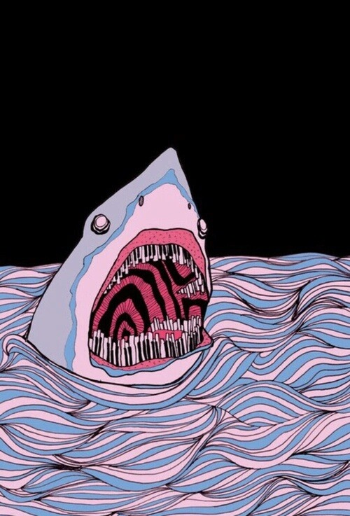

# Australian Shark Incident Database

The _Australian Shark-Incident Database_ (ASID) for quantifying temporal and spatial patterns of shark-human conflict in Australia

This is a joint project between <a href="http://www.flinders.edu.au">Flinders University</a>, the <a href="https://taronga.org.au/education/taronga-institute-of-science-and-learning">Taronga Institute of Science and Learning, Taronga Conservation Society Australia</a>, and the <a href="https://www.dpi.nsw.gov.au">New South Wales Department of Primary Industries</a>

Principal contact: 
<strong>Madeline Riley</strong> (née Thiele) 
Flinders University 
<a href="mailto:madeline.thiele@flinders.edu.au">e-mail</a>

Accompanies paper submitted to _Scientific Data_:

<a href="https://www.linkedin.com/in/madeline-thiele-7704b614a/">MJ Riley</a>, <a href="https://www.flinders.edu.au/people/charlie.huveneers">C Huveneers</a>, <a href="https://www.linkedin.com/in/david-slip-b539804b/?originalSubdomain=au">D Slip</a>, <a href="https://taronga.org.au/conservation-and-science/our-team">J West</a>, J Leto, <a href="https://www.linkedin.com/in/phoebe-meagher-471979133/?originalSubdomain=au">P Meagher</a>, <a href="https://www.dpi.nsw.gov.au/about-us/research-development/staff/staff-profiles/vic-peddemors">VM Peddemors</a>, <a href="http://www.flinders.edu.au/people/corey.bradshaw">CJA Bradshaw</a>. In review. Data Descriptor: the Australian Shark-Incident Database for quantifying temporal and spatial patterns of shark-human conflict. _Scientific Data_

The Excel workbook '<strong>Australian Shark-Incident Database_Public Version.xlsx</strong>' contains the living file that will be updated regularly by collaborators. The column descriptors are as follows:

- <strong>ISAF.no</strong>: <em>reference number in International Shark Attack File</em> (numeric)
- <strong>Details.of.person.completing.form</strong>: <em>name, date, phone and email address of person filling out questionnaire</em> (descriptive)
- <strong>Incident.month</strong>: 
- <strong>Incident.year</strong>: 
- <strong>Victim.injury</strong>: 
- <strong>State</strong>: 
- <strong>Location</strong>: 
- <strong>Latitude</strong>: 
- <strong>Longitude</strong>: 
- <strong>Site.category</strong>: 
- <strong>Site.category.comment</strong>: 
- <strong>Shark.common.name</strong>: 
- <strong>Shark.scientific.name</strong>: 
- <strong>Shark.identification.method</strong>: 
- <strong>Shark.identification.source</strong>: 
- <strong>Shark.length.m</strong>: 
- <strong>Basis.for.length</strong>: 
- <strong>Provoked.unprovoked</strong>: 
- <strong>Provocative.act</strong>: 
- <strong>No.sharks</strong>: 
- <strong>Victim.activity</strong>: 
- <strong>Fish.speared?</strong>: 
- <strong>Commercial.dive.activity</strong>: 
- <strong>Object.of.bite</strong>: 
- <strong>Present.at.time.of.bite</strong>: 
- <strong>Direction.first.strike</strong>: 
- <strong>Shark.behaviour</strong>: 
- <strong>Victim.aware.of.shark</strong>: 
- <strong>Shark.captured</strong>: 
- <strong>Injury.location</strong>: 
- <strong>Injury.severity</strong>: 
- <strong>Victim.gender</strong>: 
- <strong>Victim.age</strong>: 
- <strong>Victim.clothing</strong>: 
- <strong>Clothing.coverage</strong>: 
- <strong>Dominant.clothing.colour</strong>: 
- <strong>Other.clothing.colour</strong>: 
- <strong>Clothing.pattern</strong>: 
- <strong>Fin.colour</strong>: 
- <strong>Diversionary.action.taken</strong>: 
- <strong>Diversionary.action.outcome</strong>: 
- <strong>People < 3 m</strong>: 
- <strong>People 3–15 m</strong>: 
- <strong>Time.of.incident</strong>: 
- <strong>Depth.of.incident.m</strong>: 
- <strong>Teeth.recovered</strong>: 
- <strong>Time.in.water.min</strong>: 
- <strong>Water.temperature.°C</strong>: 
- <strong>Total.water.depth.m</strong>: 
- <strong>Water.visability.m</strong>: 
- <strong>Distance.to.shore.m</strong>: 
- <strong>Spring.or.neap.tide</strong>: 
- <strong>Tidal.cycle</strong>: 
- <strong>Wind.condition</strong>: 
- <strong>Weather.condition</strong>: 
- <strong>Air.temperature.°C</strong>: 
- <strong>Personal.protective.device</strong>: 
- <strong>Deterrent.brand.and.type</strong>: 
- <strong>Data.source</strong>: 

