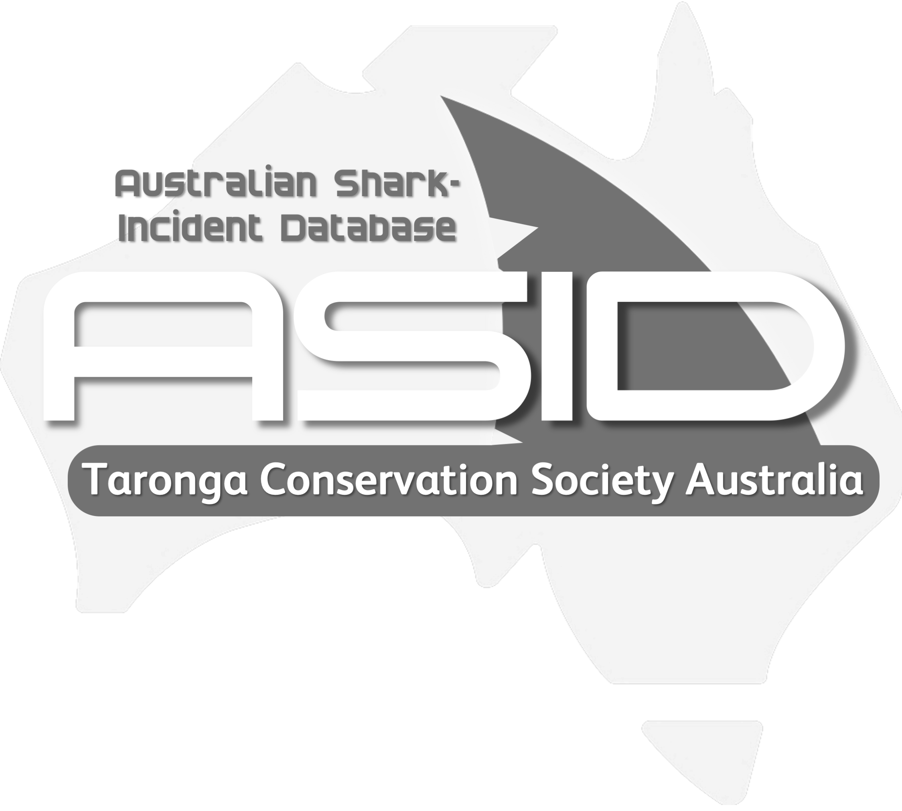

# Australian Shark-Incident Database

The <em><strong>Australian Shark-Incident Database</strong></em> (ASID), formerly known as the <em><strong><a href="https://taronga.org.au/conservation-and-science/australian-shark-attack-file">Australian Shark Attack File</a></strong></em> (ASAF), quantifies temporal and spatial patterns of shark-human interactions in Australia.
 
 
The <em><strong>Australian Shark-Incident Database</strong></em> is a joint partnership with <a href="https://taronga.org.au/conservation-and-science/our-contribution">Taronga Conservation Society Australia</a>, along with <a href="http://www.flinders.edu.au">Flinders University</a>, and the <a href="https://www.dpi.nsw.gov.au">New South Wales Department of Primary Industries</a>
 
 
Maintained as an uninterrupted record by a few committed Taronga team members since 1984, the File currently comprises > 1000 individual investigations from 1791 to today, making it the most comprehensive database of its kind available.
 
 
Principal contacts: 
- <strong>Dr Phoebe Meagher</strong>, <a href="https://taronga.org.au/education/taronga-institute-of-science-and-learning">Taronga Conservation Society Australia</a> (personal <a href="mailto:pmeagher@zoo.nsw.gov.au">e-mail</a>;  ASID <a href="mailto:ASID@zoo.nsw.gov.au">e-mail</a>)
 
- <strong>Madeline Riley</strong> (née Thiele), <a href="https://twitter.com/SouthernSharkEG">Southern Shark Ecology Group</a> & <a href="https://globalecologyflinders.com/">Global Ecology Lab</a>, Flinders University (<a href="mailto:madeline.thiele@flinders.edu.au">e-mail</a>)
 
 
Accompanies paper submitted to <em>Scientific Data</em>:
 
<a href="https://www.linkedin.com/in/madeline-thiele-7704b614a/">MJ Riley</a>, <a href="https://www.flinders.edu.au/people/charlie.huveneers">C Huveneers</a>, <a href="https://www.linkedin.com/in/phoebe-meagher-471979133/?originalSubdomain=au">P Meagher</a>, J Leto, <a href="https://www.dpi.nsw.gov.au/about-us/research-development/staff/staff-profiles/vic-peddemors">VM Peddemors</a>, <a href="https://www.linkedin.com/in/david-slip-b539804b/?originalSubdomain=au">D Slip</a>, <a href="https://taronga.org.au/conservation-and-science/our-team">J West</a>, <a href="https://globalecologyflinders.com/people/">CJA Bradshaw</a>. In review. Data Descriptor: the <em>Australian Shark-Incident Database</em> for quantifying temporal and spatial patterns of shark-human conflict. <em>Scientific Data</em>

## Code
The R code provided <code><a href="https://github.com/cjabradshaw/AustralianSharkIncidentDatabase/blob/18224b63ad4bcc3ae1bb6d90113f844b8e6657e1/Australian%20Shark-Incident%20Database%20code.R">Australian Shark-Incident Database code.R</a></code> recreates plots from the paper
 
 
Associated data files (available in the <strong><a href="https://github.com/cjabradshaw/AustralianSharkIncidentDatabase/tree/main/data">data</a></strong> subfolder) include:
- <em>ASID r version.csv</em>
- <em>ASID_injury_prop.csv</em>
- <em>tod.ts.csv</em>
- <em>tod.ws.csv</em>
- <em>top.3.csv</em>
- <em>top.sharks.csv</em>
- <em>total.bites.csv</em>

### Requires the following R libraries
- <a href="https://ggplot2.tidyverse.org/"><code>ggplot2</code></a>
- <a href="https://cran.r-project.org/web/packages/dplyr/index.html"><code>dplyr</code></a>
- <a href="https://forcats.tidyverse.org/"><code>forcats</code></a>
- <a href="https://rstudio.github.io/leaflet/"><code>leaflet</code></a>
- <a href="https://cran.r-project.org/web/packages/viridis/index.html"><code>viridis</code></a>
- <a href="https://scales.r-lib.org/"><code>scales</code></a>
- <a href="https://github.com/dkahle/ggmap"><code>ggmap</code></a>
- <a href="https://cran.r-project.org/web/packages/gridExtra/index.html"><code>gridExtra</code></a>
- <a href="https://cran.r-project.org/web/packages/rgdal/index.html"><code>rgdal</code></a>
- <a href="https://cran.r-project.org/web/packages/magrittr/index.html"><code>magrittr</code></a>
- <a href="https://tibble.tidyverse.org/"><code>tibble</code></a>
- <a href="https://cran.r-project.org/web/packages/ozmaps/index.html"><code>ozmaps</code></a>
- <a href="https://cran.r-project.org/web/packages/ggpubr/index.html"><code>ggpubr</code></a>

## The Database
The Excel workbook '<strong><a href="https://github.com/TarongaZoo/AustralianSharkIncidentDatabase">Australian Shark-Incident Database_Public Version.xlsx</a></strong>' contains the living file that will be updated regularly by collaborators. Note that some information has been removed from the public version of ASID to protect the privacy of relevant persons involved. The column descriptors are as follows:

- <strong>	Incident.month</strong>: <em>	month of year	</em>	(numeric, integer)
- <strong>	Incident.year</strong>: <em>	year written in full	</em>	(numeric, integer, <em>yyyy</em> e.g., 2007, not 07)
- <strong>	Victim.injury</strong>: <em>	outcome of victim's health. Categories: fatal, injured, or uninjured. Fatal bites include bites resulting in death to the victim. Injured bites include bites resulting in physical injury to the victim (e.g., bruising, abrasion, punctures, lacerations). Uninjured bites include interactions resulting in no injury to the victim (e.g., shark bit the victim’s equipment; surfboard, fishing rod, kayak).	</em>	(categorical)
- <strong>	State</strong>: <em>	Australian State/Territory; abbreviated; categories: WA, SA, VIC, NSW, QLD, NT, TAS	</em>	(categorical)
- <strong>	Location</strong>: <em>	closest town and/or beach	</em>	(descriptive)
- <strong>	Latitude</strong>: <em>	latitude of incident	</em>	(numeric, decimal degrees)
- <strong>	Longitude</strong>: <em>	longitude of incident	</em>	(numeric, decimal degrees)
- <strong>	Site.category</strong>: <em>	type of site where incident occurred; categories: river, estuary/harbour, coastal, ocean/pelagic, island open ocean (includes offshore shallow reefs), other; if other write: other: detail	</em>	(categorical)
- <strong>	Site.category.comment</strong>: <em>	any other relevant information regarding site description	</em>	(descriptive)
- <strong>	Shark.common.name</strong>: <em>	if identified to species, species common name; if identified to family, family group common name; common name should be Australian common names (Last and Stevens 2009); all lowercase, e.g., requiem shark	</em>	
- <strong>	Shark.scientific.name</strong>: <em>	scientific name follow CSIRO Codes for Australian Aquatic Biota; capitalise first word only; e.g., Carcharodon carcharias	</em>	
- <strong>	Shark.identification.method</strong>: <em>	what information used to identify species; categories: tooth recovered, bite analysis, shark behaviour, DNA analysis, geographical location, direct observation, other; if multiple categories relevant separate by comma; if other write: other: detail	</em>	(categorical)
- <strong>	Shark.identification.source</strong>: <em>	source for species identification; categories: witness/victim, government official, researcher, footage, other; if multiple categories relevant separate by comma; if other write: other: detail	</em>	(categorical)
- <strong>	Shark.length.m</strong>: <em>	estimated length of shark	</em>	(numeric, metres, one decimal point i.e., 3.5)
- <strong>	Basis.for.length</strong>: <em>	what information used to estimate shark length; categories: witness/victim, government official, researcher, footage, bite radius estimation, other; if multiple categories relevant separate by comma; if other write: other: detail	</em>	(categorical)
- <strong>	Provoked.unprovoked</strong>: <em>	categories: provoked, unprovoked. Unprovoked is defined as an encounter between a human and a shark where a shark is in its natural habitat and has made a determined attempt to bite a human where that person is not engaged in provocative activities. Provoked is defined as an encounter between a human and a shark where the person attracts or initiates physical contact with a shark (accidentally or on purpose) or was fishing for, stabbing, feeding, netting, or handling a shark, or where the shark was attracted to the victim by activities such as fishing, spearfishing (where a fish has already been speared), commercial diving (e.g., collecting abalone, pearl shells, or other marine animals where catch has already been collected), and cleaning of captured fish. 	</em>	(categorical)
- <strong>	Provocative.act</strong>: <em>	if provoked, basis of provocation; categories: physical contact (i.e., victim poked, stood on, held, pushed shark), enticed shark (i.e., cleaning, collecting, fishing, or feeding other sea life), capture of shark, victim moved into immediate proximity of shark, victim fed shark, victim intentionally hurt shark (e.g., stabbed shark), other; if multiple categories relevant separate by comma; if other write: other: detail	</em>	(categorical)
- <strong>	No.sharks</strong>: <em>	number sharks present at time of incident	</em>	(numeric)
- <strong>	Victim.activity</strong>: <em>	activity at time of incident; categories: snorkelling, motorised boating, unmotorised boating, boarding, spearfishing, swimming, diving, fishing, other. unmotorised boating includes canoeing, kayaking, sailing; snorkelling includes freediving; boarding includes surfboarding, bodyboarding, kiteboarding, sailboarding, wakeboarding, stand-up paddle boarding; swimming includes body surfing, clinging to object, falling into water, floating, or wading; diving includes scuba, hookah, hard-hat diving; fishing includes cleaning fish; if other write: other: detail	</em>	(categorical)
- <strong>	Fish.speared?</strong>: <em>	if the activity was spearfishing, indicate whether a fish had already been speared (either by the victim or someone in the vicinity); categories: Y, N	</em>	(categorical)
- <strong>	Commercial.dive.activity</strong>: <em>	victim commercial diving? e.g., abalone collecting, crayfishing; additional detail added to ‘Victim Activity Detail’; categories: Y, N	</em>	(categorical)
- <strong>	Object.of.bite</strong>: <em>	object shark was primarily motivated to bite (excluding victim); categories: board, dive equipment, catch (fish), vessel (including canoe/kayak), bait, other animal in area (e.g., schooling fish or dog), other; if victim, leave field blank; if multiple categories relevant separate by comma; if other write: other: detail	</em>	(categorical)
- <strong>	Present.at.time.of.bite</strong>: <em>	other activities present in area; categories: boating, swimming, boarding, snorkelling, scuba-diving, freediving, fishing, spearfishing, bait and/or berley, catch, abattoir, baitfish, fish cleaning, commotion/splashing, dead animal nearby (e.g., whale), discharge site (e.g., river mouth, desalination plant), other sea life (e.g., seals, turtles, dolphins; specify in bracket), other; if multiple categories relevant separate by comma; if other write: other: detail	</em>	(categorical)
- <strong>	Present.at.time.of.bite.detail</strong>: <em>	provide detail about other activities present; e.g., crayfish bagged, grabbed shark by tail	</em>	(descriptive)
- <strong>	Direction.first.strike</strong>: <em>	direction from which shark first made contact with victim, e.g., first bite, initial bump; categories: above, below, behind, in front, left, right; if multiple categories relevant separate by comma	</em>	(categorical)
- <strong>	Shark.behaviour</strong>: <em>	describe the sharks behaviour prior, during and/or after the incident took place	</em>	(descriptive)
- <strong>	Victim.aware.of.shark</strong>: <em>	whether victim was aware of shark prior to incident; categories: Y, N	</em>	(categorical)
- <strong>	Shark.captured</strong>: <em>	whether shark was captured after incident; categories: Y, N	</em>	(categorical)
- <strong>	Injury.location</strong>: <em>	which areas on victim injured by shark; categories: arm, hand, lower arm, upper arm, shoulder, neck, head, torso, leg, foot, calf, thigh, pelvic region, other; if multiple categories relevant separate by comma; if other write: other: detail	</em>	(categorical)
- <strong>	Injury.severity</strong>: <em>	severity of victim’s injuries sustained from shark; categories: bruising, abrasion (removal of skin, i.e., grazes/scratches), punctures, minor lacerations (i.e., punctured/torn skin and soft tissue; loss of function is not seen), major lacerations (i.e., punctured/torn skin, muscle, tendon, or bone; loss of function seen; surgical procedures required), bone break (including fractures), injuries to internal organs (e.g., ruptured lung), amputation, other; if multiple categories relevant separate by comma; if other write: other: detail	</em>	(categorical)
- <strong>	Victim.gender</strong>: <em>	categories: female, male, other; if multiple categories relevant separate by comma; if other write: other: detail	</em>	(categorical)
- <strong>	Victim.age</strong>: <em>	age of victim in years	</em>	(numeric, integer, years)
- <strong>	Victim.clothing</strong>: <em>	what victim was wearing at time of incident; categories: clothes, swimwear, wetsuit/drysuit, shark-proof suit, none, other; if other write: other: detail	</em>	(categorical)
- <strong>	Clothing.coverage</strong>: <em>	% body coverage victim’s clothing provided; categories: full body, full arm-short legs, short arm-full legs, short arm-short legs, short only, one-piece, bikini, speedo	</em>	(categorical)
- <strong>	Dominant.clothing.colour</strong>: <em>	clothing colour accounting for > 50% overall colour; categories: black, grey, white, blue, yellow, orange, red, green, pink, purple, brown, metallic, multicolour, other; if two colours dominant (i.e., 50% each) write: multicolour: colour, colour; if other write: other: detail	</em>	(categorical)
- <strong>	Other.clothing.colour</strong>: <em>	other colour/s present on clothing; categories: black, grey, white, blue, yellow, orange, red, green, pink, purple, brown, multicolour, other; if multiple categories relevant separate by comma; if other write: other: detail	</em>	(categorical)
- <strong>	Clothing.pattern</strong>: <em>	any dominant pattern/s on victim’s clothing; categories: block colour, camouflage, stripe, checkered, swirl, floral, speckled, other; if multiple categories relevant separate by comma; if other write: other: detail	</em>	(categorical)
- <strong>	Fin.colour</strong>: <em>	colour/s on victim’s fins/flippers; categories: black, grey, white, blue, yellow, orange, red, green, pink, purple, brown, metallic, multicolour, translucent, other; if two colours dominant (i.e., 50 % each) write multicolour: colour, colour; if other write: other: detail	</em>	(categorical)
- <strong>	Diversionary.action.taken</strong>: <em>	if applicable, how victim or others took action to divert shark	</em>	(descriptive)
- <strong>	Diversionary.action.outcome</strong>: <em>	effect of diversionary action taken; categories: no effect, effective, shark bite, shark released victim momentarily then renewed attack, shark released victim permanently, shark left the area, shark killed, shark kept at a distance, shark followed, other; if multiple categories relevant separate by comma; if other write: other: detail	</em>	(categorical)
- <strong>	People < 3 m</strong>: <em>	number of people within 3 metres of incident	</em>	(numeric, integer)
- <strong>	People 3–15 m</strong>: <em>	number of people between 3 and 15 m of incident	</em>	(numeric, integer)
- <strong>	Time.of.incident</strong>: <em>	time of day incident occurred	</em>	(numeric, 24-hour time; no colon i.e., 1830)
- <strong>	Depth.of.incident.m</strong>: <em>	estimated depth at which the shark bite took place (not total water depth)	</em>	(numeric, metres, to one decimal point i.e., 3.5)
- <strong>	Teeth.recovered</strong>: <em>	whether any shark teeth or teeth fragments found in victim or victim’s equipment; categories: Y, N	</em>	(categorical)
- <strong>	Time.in.water.min</strong>: <em>	estimated time victim was in water prior to incident	</em>	(numeric, minutes)
- <strong>	Water.temperature.°C</strong>: <em>	temperature of water at time and place of incident	</em>	(numeric, °C, one decimal point i.e., 15.5)
- <strong>	Total.water.depth.m</strong>: <em>	estimated total depth (surface to sea/river floor) at which incident took place	</em>	(numeric, metres, to one decimal point i.e., 3.5)
- <strong>	Water.visability.m</strong>: <em>	estimated water clarity at area and time at which incident took place	</em>	(numeric, metres, to one decimal point i.e., 3.5)
- <strong>	Distance.to.shore.m</strong>: <em>	estimated distance from where incident took place to closest land mass	</em>	(numeric, metres, to one decimal point i.e., 50.5)
- <strong>	Spring.or.neap.tide</strong>: <em>	tide type at time of incident; categories: spring, neap	</em>	(categorical)
- <strong>	Tidal.cycle</strong>: <em>	tidal cycle at time of incident; categories: low, mid, high	</em>	(categorical)
- <strong>	Wind.condition</strong>: <em>	Beaufort wind force scale of sea state at time of incident; categories: calm, light breeze, moderate breeze, windy	</em>	(categorical)
- <strong>	Weather.condition</strong>: <em>	state of weather at time of incident; categories: sunny, cloud cover, overcast, rainy, stormy, other; if multiple categories relevant then separate by comma; if other write: other: detail	</em>	(categorical)
- <strong>	Air.temperature.°C</strong>: <em>	ambient air temperature at time and place of incident	</em>	(numeric, °C, to one decimal point i.e., 15.5)
- <strong>	Personal.protective.device</strong>: <em>	whether the victim was using protective equipment during incident; categories: speargun, deterrent/repellent, knife, board, shark suit, other; if multiple categories relevant then separate by comma; if other write: other: detail	</em>	(categorical)
- <strong>	Deterrent.brand.and.type</strong>: <em>	if deterrent/repellent used, brand, make, model, and whether was in effect/switched on/off	</em>	(descriptive)
- <strong>	Data.source</strong>: <em>	information used to compile this record; selected categories should be direct account from source (e.g., victim interview in newspaper article should be categorised as media outlet not victim account); categories: ASID questionnaire, other questionnaire (specify in brackets), victim account, witness account, other person account, government report, expert (e.g., researcher, medical professional), book, media outlet, footage, other; if multiple categories relevant then separate by comma; if other write: other: detail	</em>	(categorical)
- <strong>	Reference</strong>: <em>	reference for data source if applicable, e.g., newspaper publication title and date	</em>	(descriptive)

## Relevant References
- Bradshaw, CJA, P Meagher, MJ Thiele, RG Harcourt, C Huveneers. 2021. <a href="https://doi.org/10.1098/rsos.201197">Predicting potential future reduction in shark bites on people</a>. <em>Royal Society Open Science</em> 8:201197 (see related <a href="https://github.com/cjabradshaw/sharkbite">Github Repository here</a>)
- Chapman BK, McPhee D. 2016. <a href="http://dx.doi.org/10.1016/j.ocecoaman.2016.09.010">Global shark attack hotspots: identifying underlying factors behind increased unprovoked shark bite incidence</a>. <em>Ocean and Coastal Management</em> 133:72-84
- Coppleson V. 1933. <a href="http://dx.doi.org/10.5694/j.1326-5377.1933.tb75492.x">Shark attacks in Australian waters</a>. <em>Medical Journal of Australia</em> 1:449-467
- Ryan, LA, SK Lynch, RG Harcourt, DJ Slip, V Peddemors, JD Everett, L-M Harrison, NS Hart. 2019. <a href="https://doi.org/10.3354/meps13138">Environmental predictive models for shark attacks in Australian waters</a>. <em>Marine Ecology Progress Series</em> 631:165-179
- West JG. 2011. <a href="http://dx.doi.org/10.1071/MF10181">Changing patterns of shark attacks in Australian waters</a>. <em>Marine and Freshwater Research</em> 62:744-754

